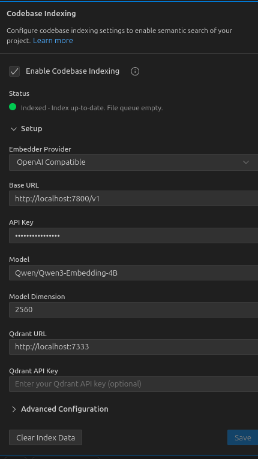

# Qwen3 Embedding Service for Codebase Indexing


## 🚀 Quick Start

```bash
# Clone and setup
git clone git@github.com:Michaelzag/docker-scripts.git
cd qwen3-embedding
docker compose up -d
```

Service runs at: **http://localhost:7800**

## 📋 Configuration

**Key Settings (.env):**
- **Model**: Qwen/Qwen3-Embedding-4B
- **GPU Memory**: 0.5 (50% utilization)
- **Quantization**: FP8
- **Dimensions**: 2560
- **Max Context**: 8192 tokens

## 🔧 IDE Integration



**For OpenAI-compatible providers:**

| Setting | Value |
|---------|-------|
| Base URL | `http://localhost:7800/v1` |
| API Key | `sk-dummy-key` |
| Model | `Qwen/Qwen3-Embedding-4B` |
| Dimensions | `2560` |

## 📡 API Usage

**Create Embeddings:**
```bash
curl -X POST "http://localhost:7800/v1/embeddings" \
  -H "Content-Type: application/json" \
  -d '{
    "model": "Qwen/Qwen3-Embedding-4B",
    "input": "your text here"
  }'
```

**Health Check:**
```bash
curl http://localhost:7800/health
```

## ⚡ Performance

- **Concurrent Requests**: 256 sequences
- **Batch Size**: 32K tokens
- **GPU**: RTX 5080 optimized
- **Memory**: ~7.7 GB usage

## 🛠️ Troubleshooting


**Memory issues:**
- Reduce `QWEN3_EMBEDDING_GPU_MEM` in `.env`
- Current: 0.5 (increase if needed, decrease if OOM)

**Performance tuning (in .env):**
- Increase `QWEN3_MAX_NUM_SEQS` for more concurrency
- Adjust `QWEN3_MAX_NUM_BATCHED_TOKENS` based on needs
- Reduce `QWEN3_EMBEDDING_GPU_MEM` if memory issues occur